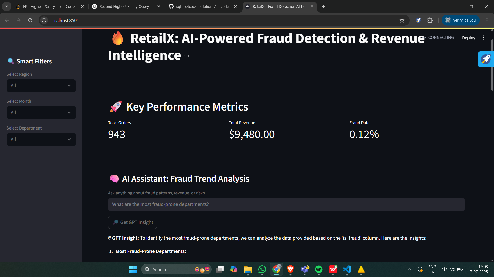
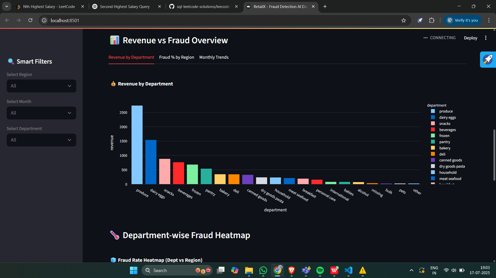
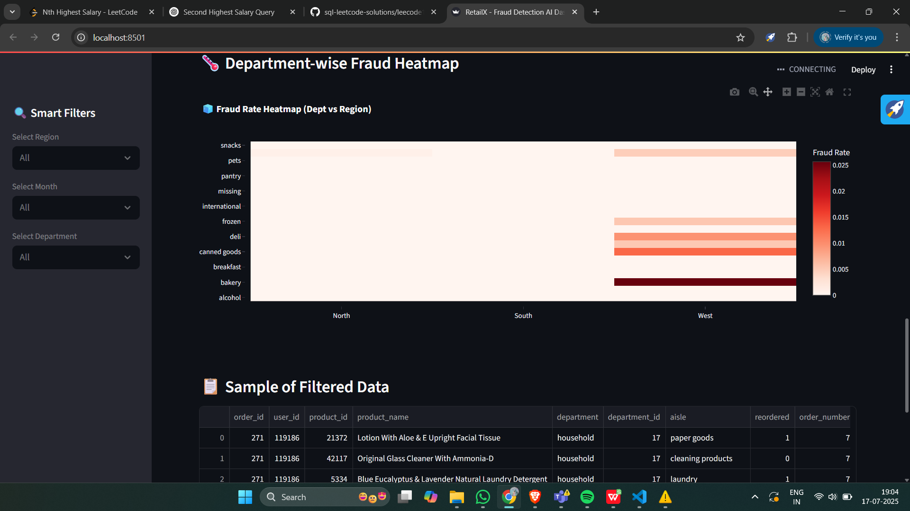

# 🛒 RetailX: GPT-Powered Sales Analytics & Fraud Detection on 3M+ Orders

🚀 **RetailX** is an AI-powered retail intelligence dashboard that analyzes over 3 million real-world grocery orders using **Databricks + GPT + Streamlit**.
 It enables deep insights into sales performance, fraud detection, and region-wise trends — all controlled through a smart natural language assistant.

### 
🌐 [Live Demo App](https://databricksfraudai-eabvl6ka4zbnpwegezffec.streamlit.app/) &nbsp;|&nbsp; 
📽️ [Demo Video](https://your-loom-link.com) &nbsp;|&nbsp; 
📊 [Dataset: Instacart 3M Orders](https://www.instacart.com/datasets/grocery-orders)

---

## Features

- **GPT-Powered Assistant**: Ask natural questions about sales, fraud, trends (e.g., *"Top 5 departments by revenue in the West region"*)
- **Real-Time Fraud Detection**: Detect anomalies in orders using rule-based + ML logic
- **Sales Dashboards**: Analyze performance by region, department, and time period
- **Dynamic Filters**: Region, Date Range, Category, Fraud Level
- **Large-Scale Analytics**: Processes 3M+ orders using Apache Spark on Databricks
- **AI Skill Matching**: Personalized GPT insights on risk/fraud scoring
- **Modern UI**: Clean, responsive, interactive with visual clarity

---

## Technologies Used

| Layer        | Tools Used |
|--------------|------------|
| **Backend**  | Python, Pandas, PySpark, SQL |
| **AI Layer** | OpenAI GPT-4 API |
| **Data Infra** | Databricks (Spark), Delta Tables |
| **Frontend** | Streamlit |
| **Deployment** | Streamlit Cloud |
| **Version Control** | Git + GitHub |

---

## 📊 Key Visuals

### 🔎 GPT Skill Match Assistant


### 📈 Fraud Detection by Department & Region


### 📊 Revenue Trends + Filters


---

## 🧪 Sample GPT Queries
> Try these directly inside the dashboard:
- `"Show top 3 departments by revenue in the South region"`
- `"Detect fraudulent transactions in dairy products"`
- `"List categories with lowest average order size"`

---

## 🧼 Fraud Detection Logic (Simplified)

| Rule | Description |
|------|-------------|
| Order quantity > 20 | Flag as suspicious |
| High-value order in low-volume category | Flagged |
| Repeated timestamp or same IP (if extended) | Potential fraud |

---

## 📁 File Structure

```bash
RetailX/
│
├── app.py                  # Streamlit app entry           
├── databricks_utils.py     # Spark SQL connectors
├── fraud_engine.py         # Fraud detection logic
├── images/                 # Charts, logos, images
├── requirements.txt        # Dependencies
├── README.md               # This file
